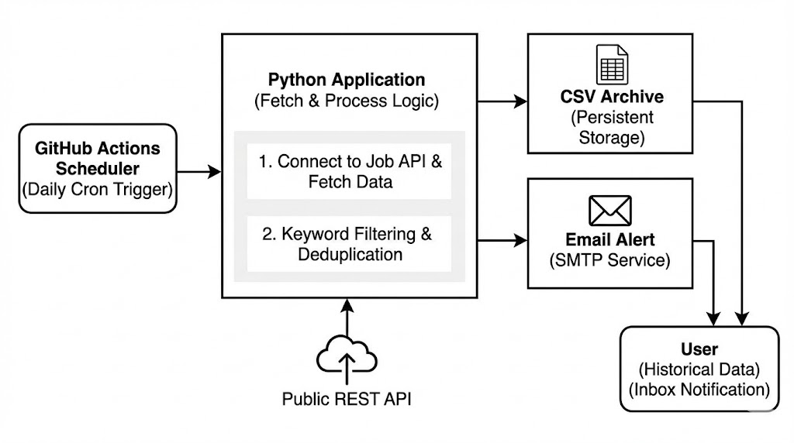
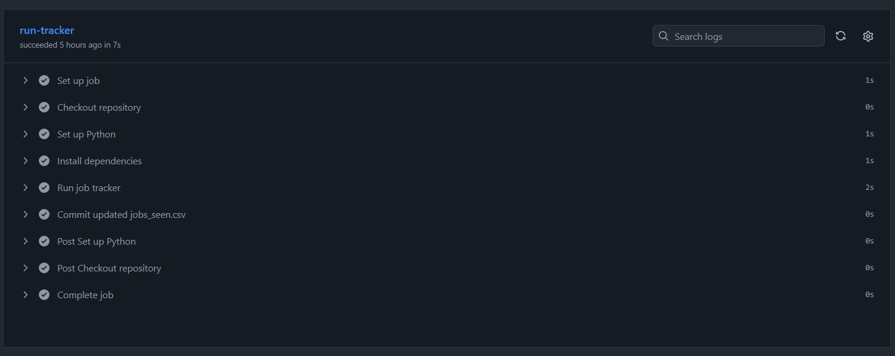
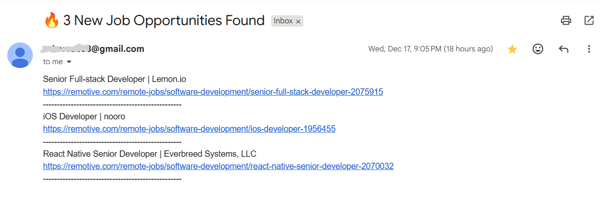

# Ping

I built **Ping** because I was tired of the morning grind waking up, opening ten different tabs and scrolling through the same job boards every single day. As my very first automation project, I wanted to create something that does the boring stuff for me while I sleep. Instead of me hunting for jobs, the jobs now come to me.

---

## The Backstory
The goal was simple **Total Autonomy.** I wanted a system that was "set it and forget it." I didn't want to run a script manually or keep my laptop open all night. By combining Python with GitHub Actions, I built a "silent partner" that wakes up every 24 hours, scans the market, and pings my inbox only when it finds something worth my time.

---

## How it Works

The logic follows a clean, three-step cycle every single day:

1. **The Hunt:** The script connects to the API to fetch the latest postings. It filters them based on the specific roles and keywords I care about (so no more irrelevant noise).
2. **The Archive:** It saves every new job into a local `.csv` file. This acts as my personal database so I can track my history and never apply to the same place twice.
3. **The Ping:** If it finds a match, it sends a formatted email digest directly to my inbox.

---

## Tech & Security
I built this using **Python** for the logic and **GitHub Actions** to handle the scheduling (Cron).

Since this deals with email, security was a big priority for me. I made sure that:
* **No secrets are hardcoded:** My email credentials and API keys are stored safely in GitHub Secrets.
* **Persistent State:** It’s smart enough to know which jobs it has already seen, so I don't get spammed with the same "ping" twice.

---

## Contributing
Found a bug or have an idea? Feel free to open an issue or submit a pull request. I'd love to hear from you.
